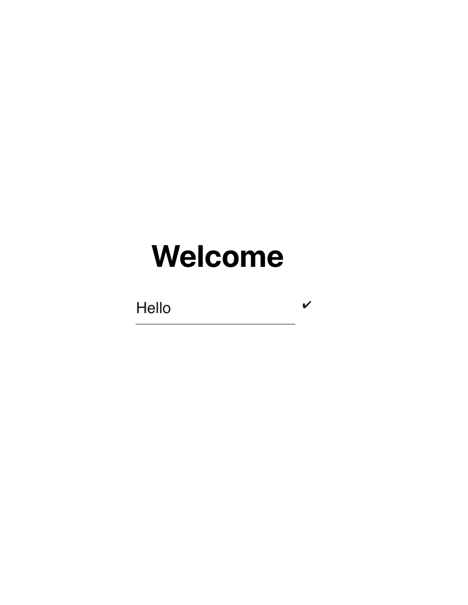
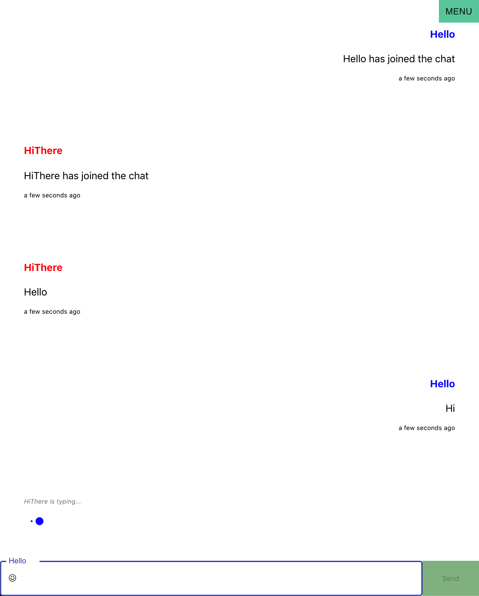
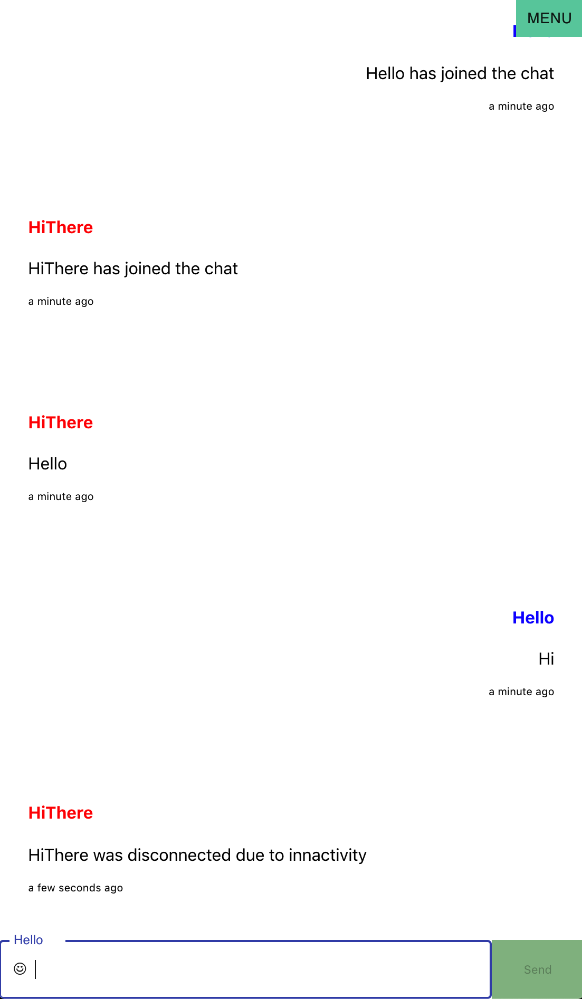

## Chat App

Realtime chat app using Socket.io.
 

Client:
React, Redux, React router dom, Socket.io-client, Styled Components, Material UI. 
 
Deployed using [Netlify](https://5e945db595f5da7b2445495f--scapigliata-chat-app-client.netlify.com/).

 

Server: Express, Socket.io, Winston. Deployed using Heroku. 
 
Deployed using [Heroku](https://scapigliata-chat-app-server.herokuapp.com/).

## Getting started:

CLIENT: In the project directory, cd into client and run:

### `npm i && npm start`

SERVER: In the project directory, cd into server and run:

### `npm i && npm run dev`

To use the debug logger and start the server, run:

### `npm run log`

 

## LandingPage

## Chat

## Innactive User

